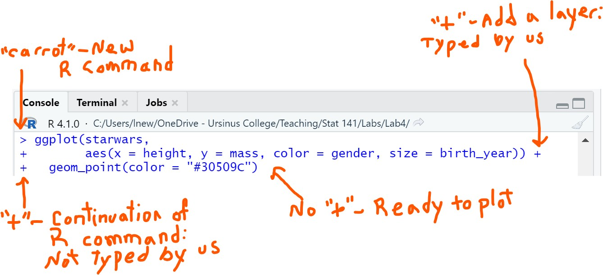

# Order Matters

`R` is a sequential programming language, which means that we have to run our code in order, from the top of a page to the bottom, if we want it to work properly. Therefore the first thing we always do is load the necessary R packages from our library:

```{r load-packages, results='hide', message=FALSE, warning=FALSE}
library(tidyverse)
```


# Building Figures in `R` Using `ggplot`

When we build a figure using `ggplot` we are building the plot in layers, starting by telling `R` what data set and variables to use. The arguments to the `ggplot` function are:

-   `data` \hspace{5mm} The name of the data set to be used for the plot. Must be a dataframe.     
-   `aes` \hspace{5mm} The aesthetics that should be plotted. These are the variables we want to include in the figure, and we need to tell `R` where to plot them (e.g., on the `x` axis, `y` axis, as a `color`, etc.)

The name of the data set, and the variables, should **not** be in quotation marks, since we are telling `R` to find objects with those names and use them in the plot.

## Plotting Variables in `ggplot`

The package `ggplot2` is part of the tidyverse and allows us to make some very attractive figures. The main function that creates these plots is `ggplot`, which has a number of arguments, as well as additional information we can add to it.

The function `aes` occurs *within* the `ggplot` function, and as arguments of its own that defines how the variable should be included in the visualization:

-   `x` \hspace{5mm} the variable to plot on the x-axis
-   `y` \hspace{5mm} the variable to plot on the y-axis
-   `color` \hspace{5mm} the color of a point represents the value of the selected variable
-   `shape` \hspace{5mm} the shape of a point represents the value of the selected variable
-   `size` \hspace{5mm} the size of a point represents the value of the selected variable
-   `fill` \hspace{5mm} the internal color of a bar represents the value of the selected variable 

## Adding layers to plots

Once we have created a ggplot object with `ggplot`, we need to add layers to it so that `R` knows what type of plot to make, whether to add labels and titles, as well as other things, like the angle of the text. Each of these layers is added to the figure used the `+`. 

If we look at the `R` Console when we do tell `R` that we are planning to add another layer to our plot, we can see that the usual "carrot", `>`, is also replaced by a plus symbol, "`+`" (not typed by us, but included by `R` automatically). This lets us know that `R` isn't ready to create the figure because it thinks we still want to add more layers, continuing our previous code. That means that after the last layer we exclude the plus sign.

```{r echo=FALSE,out.width="60%",fig.align='center'}

```

If we ever end up with a `+` in the `R` Console and need to get rid of it, we can press the `Esc` key. However, this does mean the code we have written won't work, since `R` thought we still had more to type.

\newpage

### Layer for the type of plot

After using `ggplot`, we need to add to it the layer that tells `R` the type of plot. These always start with `geom_`, where "geom" is short for geometry. 

-   `geom_point`  \hspace{5mm} scatter plot
-   `geom_bar`  \hspace{5mm} bar charts
-   `geom_boxplot`  \hspace{5mm} box plots
-   `geom_histogram`  \hspace{5mm} histograms
-   `geom_line`  \hspace{5mm} connects observations to create a line

These commands inherit the information we gave to `ggplot`, so it isn't always necessary to provide them with arguments of their own.

### Layer for figure title and lables

When building figures in `R`, informative labels for the title, x and y axes, and size of points can be added using the `labs` command and indicating what component of the plot we wish to add a label for. 

- `labs` \hspace{5mm} the function to add labels and titles to a ggplot

Below are the arguments to the `labs` function that tell it where to add the text:

-   `title` \hspace{5mm} the title for the figure
-   `x` \hspace{5mm} the label for the x-axis
-   `y` \hspace{5mm} the label for the y-axis
-   `size` \hspace{5mm} the label for the legend defining what the size of the points represents
-   `color` \hspace{5mm} the label for the legend defining what the color of the points represents
-   `shape` \hspace{5mm} the label for the legend defining what the shape of the points represents
-   `fill` \hspace{5mm} the label for the legend defining what the fill of the bars represents

The lables and titles we are adding must always be in quotation marks, so that `R` recognizes it as text.

### Layer for plot theme

Themes are what are used to customize the non-data components of our plots, such as the size of the text, fonts, background, gridlines, angle of text, etc. There are too many arguments to list them all here, but we will see some useful ones in the labs, and can always find out more by looking at the helpfile in `R` by typing `?theme` into the `R` Console.

-   `theme` \hspace{5mm} used to customize the non-data components of our plots

