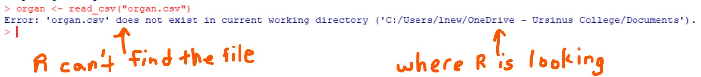
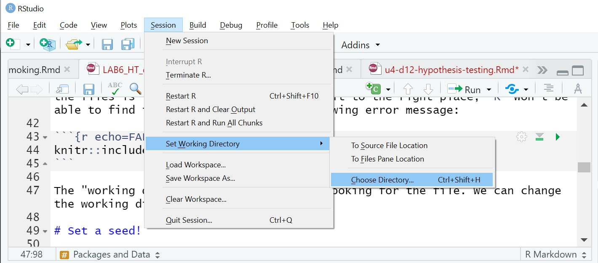

# Loading Data into `R`

## Functions for loading data into `R`

Most of the time, we need to import data into `R`, and the functions used to load data are specific to the type of file we have saved our data as. Using the `dplyr` package in `R`, some examples are:

-   `read_csv` \hspace{5mm} loads data saved as a .csv (comma delimited) file   
-   `read_tsv` \hspace{5mm} loads data saved as a .tsv (tab-separated value) file   
-   `read_delim` \hspace{5mm} loads data saved with other deliminators, often used with .txt (text) files

For each function, we need to give `R` the name of the file we want to import, including the extension type (e.g., .csv, .xlsx, etc.) and include the name of the file in quotation marks. We use quotation marks because the function is telling `R` to go looking for the text that describes our file, as opposed to an object or data that already exist in `R`.

The most common file type we will use is a .csv file, and therefore we will most regularly use the `read_csv` function. One of the reasons for this is that comma delimited files can be used to move information between programs that aren't ordinarily able to exchange data. For example, even if we create and save our data in Excel, we will still be able to share it with someone who uses Numbers.

## Helping `R` Find Files

The best way to help `R` easily find files to to save all connected files (e.g., lab templates and lab data sets) in the same folder in our computer. The folder should be specific to the class or project (e.g., GLM Course). **We are strongly advised against saving everything in our Downloads file or on our Desktop**. The location where we save the files is important. If we don't save it to the right place, `R` won't be able to find it.

## Error Messages 

If we don't save our files to the right location, we will get the following error message:

```{r echo=FALSE,eval=TRUE, out.width="80%",fig.align="center"}

```

The "working directory" is where `R` is looking for the file. If we get this error message we can change the working directory by going to Session, choosing Set Working Directory, and then Choose Directory... after which we can select the location in which we have saved the data file. 

```{r echo=FALSE,eval=TRUE, out.width="60%",fig.align="center"}

```

We need to be careful if we decide to change the working directory, though, as this will also change the place where `R` and RStudio automatically save files.  It is generally easier to save the data file in the correct location in the first place.

We will also need to be careful with our spelling. `R` will only recognize a file name exactly as we have saved it, including spelling errors, extra spaces and capitalization. 


# Types of variables

`R` makes a determination as to the type of variables we are loading into the program.`R` stores the data as either double, integer, complex, logical or character.

-   `int` \hspace{5mm} integer - whole numbers
-   `dbl` \hspace{5mm} double - any real number (i.e., decimals are possible)
-   `chr` \hspace{5mm} character - character vectors or strings
-   `dttm` \hspace{5mm} date-times - a date and a time
-   `lgl` \hspace{5mm} logical - contains only `TRUE` or `FALSE` values
-   `fctr` \hspace{5mm} factors - categorical variables with fixed possible values
-   `date` \hspace{5mm} date - a calendar date

When we read data into `R`, create data or use an existing data set, `R` it automatically assigns each variable to a data type.  

\newpage

# Data Summaries

There are many different `R` functions that we can use for the initial exploration of a data set, or to check if our data wrangling has done what we expected.

-  `dim` \hspace{5mm} The dimensions of a data set. The number of rows (i.e., the number of observations) is always given first, followed by the number of columns (i.e., the number of variables)   
-  `nrow` \hspace{5mm} Counts the number of rows in a data set   
-  `ncol` \hspace{5mm} Counts the number of columns in a data set   
-  `str` \hspace{5mm} The structure of the data set. This gives the dimensions of the data table, as well as the name of all of the columns preceded by a `$` sign, the type of variable and examples of the first couple of entries.    
-  `glimpse` \hspace{5mm} A summary similar to that provided by `str`, but a little neater. Part of the package `dplyr` in the tidyverse.

# Logical Operators

When working with data in `R` we may often want to manipulate it so that we are only working with a subset of the information that meets certain criteria, so as being greater than a given value, or not equal to a specific word. We can do this using logical operators:

-   `>`   \hspace{7mm}   greater than
-   `<`   \hspace{7mm}   less than
-   `<=`  \hspace{6mm}   less than or equal to
-   `>=`  \hspace{6mm}   greater than or equal to
-   `==`  \hspace{6mm}   exactly equal to
-   `!=`  \hspace{6mm}   not equal to
-   `!x`  \hspace{6mm}   not `x` (where `x` is replaced with the name of a variable we want to avoid)
-   `x|y` \hspace{5mm}   `x` OR `y` (where `x` and `y` are replaced with the names of variables we are interested in)
-   `x&y` \hspace{5mm}   `x` AND `y` (where `x` and `y` are replaced with the names of variables we are interested in)

# Core Statistics Functions

-   `min` \hspace{5mm} finds the minimum value of a variable
-   `max` \hspace{5mm} finds the maximum value of a variable
-   `mean` \hspace{5mm} calculates the mean of a variable
-   `median` \hspace{5mm} calculates the median of a variable
-   `sd` \hspace{5mm} calculates the standard deviation of a variable
-   `var` \hspace{5mm} calculates the variance of a variable

All functions have inputs they require to run. Sometimes arguments have defaults, which mean we don't need to do anything about them, so long as the default value is the one we want to use. In other cases we will be required to give a function specific types of information in order to do the analysis. For all of the functions here, the information we need to give them is the data for the variable for which we want to calculate the summary statistic.

# Wrangling Data

The tidyverse is an opinionated collection of `R` packages designed for data science that share an underlying philosophy and common grammar. One of the nice things about the tidyverse is that the functions for wrangling data are often verbs describing exactly what we want to do. As a result, we will focus on manipulating and wrangling data using tidyverse tools. 

-   `select` \hspace{5mm}  used to *select* which variables to keep or exclude. Can also be used to identify variables with certain characteristics (e.g., the word `time` in the variable name)   
-   `filter` \hspace{5mm} used to subset a data frame, retaining only those rows that satisfy our conditions. We are *filtering* the data set to only keep the observations of interest.   
-   `count` \hspace{5mm} used to *count* the unique values within one or more variables   
-   `mutate` \hspace{5mm} used create new variables (i.e., columns) that are functions of existing variables. That is, we are *mutating* our data.   
-   `summarize` \hspace{5mm} used to *summarize* variables of our choice by values such as the mean, median, minimum or maximum.   
-   `group_by` \hspace{5mm} used to *group* the data, or its summaries, *by* categories within a variable.

When we tell these functions which variables to use, we use the name of the variable, exactly as it appears in our data set, without any quotation marks around it.
