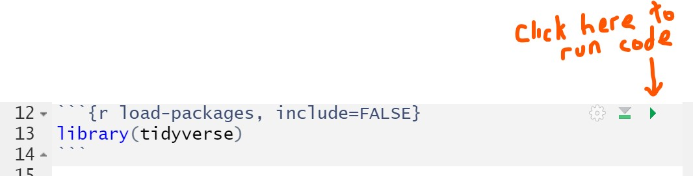
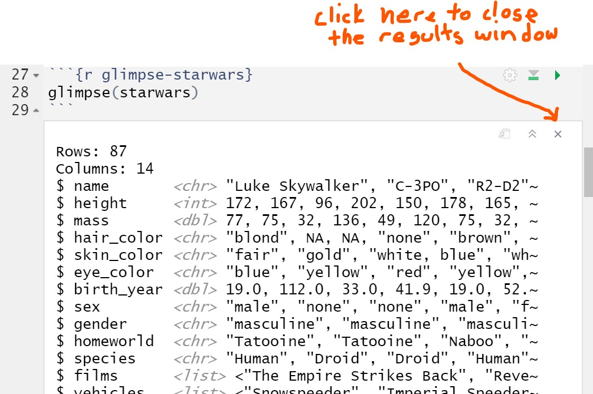
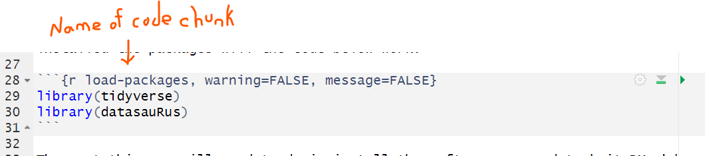
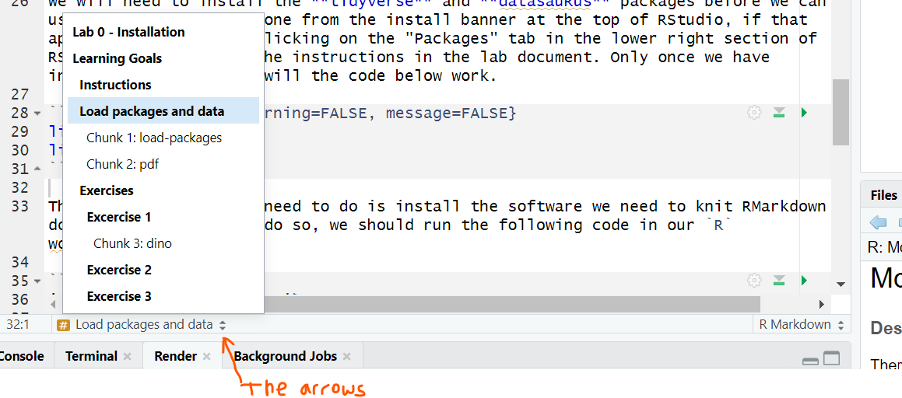

# Code Chunks

In R Markdown files, code appears in grey boxes with three ticks in the top left of they grey box and three at the bottom left. This defines the "code chunk", which is the set of lines of code that we want to run in this particular location in the document. If we want to run the code in the grey box we can do so by clicking on the little green arrow in the upper right hand corner.

```{r echo=FALSE, out.width="60%",fig.align='center'}

```

# Order Matters

`R` is a sequential programming language, which means that we have to run our code in order, from the top of a page to the bottom, if we want it to work properly. Therefore the first thing we always do is load the necessary R packages from our library:

```{r load-packages, results='hide', message=FALSE, warning=FALSE}
library(tidyverse)
```


# Windows in RMarkdown

One of the things that happens when you run code through RMarkdown by clicking on the green arrow is that an output window opens in the .Rmd file. While this is helpful, it can also be a pain when we are trying to move quickly between different sections of code or text. The output windows can be closed by clicking on the 'x' in the upper right hand corner of the window.

```{r echo=FALSE,out.width="60%",fig.align='center'}

```

# Navigating RMarkdown Files

It is generally good practice to name code chunks:

```{r echo=FALSE,out.width="60%",fig.align='center'}

```

The purpose of these names is primarily to help us navigate an RMarkdown file. If we look in the bottom left corner of the RMarkdown file, we will see some text with up and down arrows next to it. If we click on the arrows it will bring up a list of all the section names in the document (in bold), as well as all the code chunks, with their names. 

```{r echo=FALSE,out.width="60%",fig.align='center'}

```


If we click on one of the names in the list, we will be taken directly to that part of the RMarkdown document. If we name our code chunks, then it makes it easier to quickly identify and navigate to the area of the document that we want to work in.


