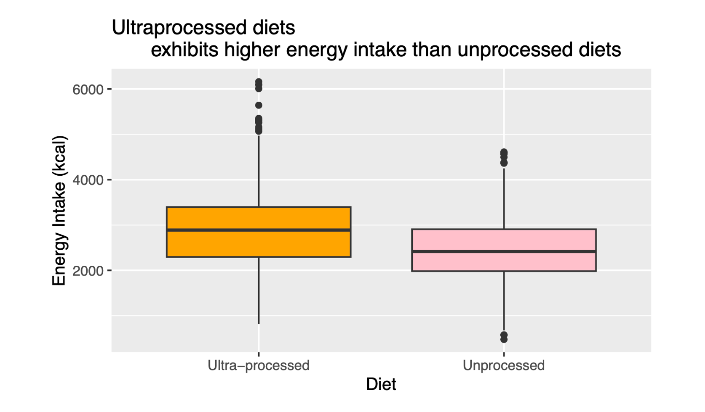
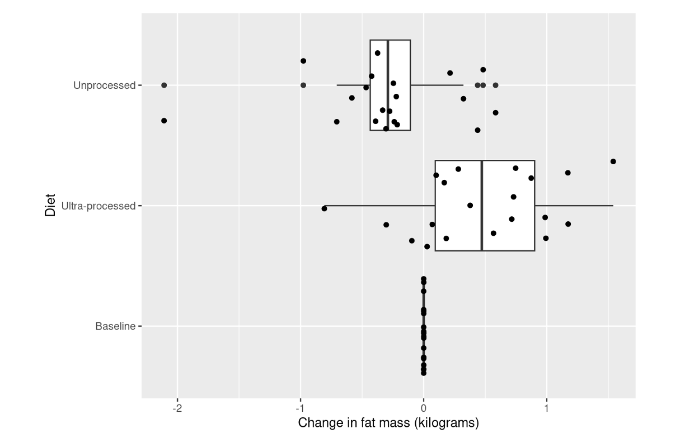
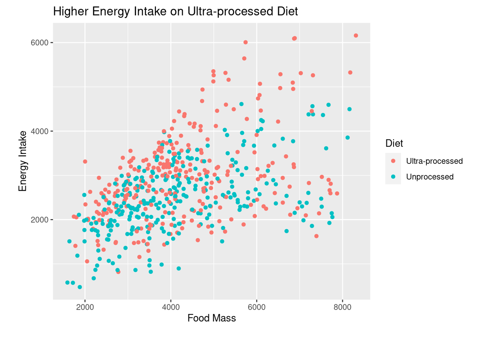
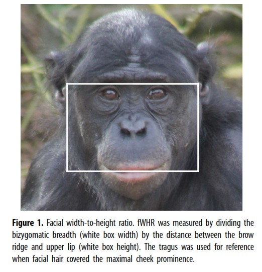

```{r, setup-lm1, include=FALSE}
library(ggformula)
library(tidyverse)


knitr::opts_chunk$set(echo = TRUE, 
                      fig.width = 7, 
                      fig.height = 3,
                      tidy = FALSE,
                      fig.align = 'center', 
                      message = FALSE, 
                      warning = FALSE,
                      error = TRUE,
                      out.width = '60%', 
                      dpi = 300)
theme_set(theme_minimal(base_size = 22))
```

class: huge, subsection, inverse, center
<br>
<br>
# Why?
---
## Your First Dataset

```{r, echo = FALSE, out.width="70%"}
knitr::include_graphics("https://cdn.ncbi.nlm.nih.gov/pmc/blobs/5a03/7946062/f82cddc1b990/nihms-1528772-f0001.jpg")
```

---
## Or...the student versions

```{r, echo = FALSE, out.width="99%"}

```

---
## Or...the student versions

```{r, echo = FALSE, out.width="99%"}

```

---
## Or...the student versions

```{r, echo = FALSE, out.width="99%"}

```

---
# So, Why?

- Understand how *more than one thing* at a time influences our outcome
- *Quantify* which patterns are likely real and which might be just noise

---
# Data
[*Facial width-to-height ratio is associated with agonistic and affiliative dominance in bonobos (**Pan paniscus**)*](https://royalsocietypublishing.org/doi/suppl/10.1098/rsbl.2019.0232) (J.S. Martin and colleagues)

.small[
```{r data-in, message = FALSE}
bonobos <- 
  read_csv(file='https://sldr.netlify.app/data/bonobo_faces.csv')
```
]

```{r include = FALSE}
# add one missing for demo purposes
bonobos[28, 'normDS'] <- NA
```

---

## Facial Width-Height Ratio

```{r bonobo-fwhr-image, echo = FALSE, out.width = '45%'}

```


---

# Data: Variables
### We *will* explore data - let's think a bit first.
.small[
.pull-left[
- `Name` of the individual
- `Group`: zoo where the individual lives
- `Sex`, "Male or "Female"
- `Age` in years
]

.pull-right[
- `fWHR`, facial width-height ratio
- `AssR`, assertiveness score
- `normDS`, another dominance score
- `weight` in kilograms
]
]


---

## Simple Linear Regression
### ("Simple" means "one predictor")

$$ y = \text{  ?} $$
<!-- $$\beta_0 + \beta_1 x \dots$$ -->

---

# Choose Response

- Response is the variable of greatest interest
- Response is what you may want to *predict*
- Response may be causally dependent on predictor

---

# Choose Predictor(s)

- Response may be harder to measure, and predictor easier
- (Should have data on predictor)
- **Choosing predictor that "looks best" in data -> biased inference**

---

# For Bonobos:

- Response
- Predictor

---

# Plan. STOP! Explore.

```{r}
gf_point(AssR ~ fWHR, data = bonobos)
```


---

# To fit model: `lm()`

```{r hidden-fit-m1_simple, include = FALSE}
m1_simple <- lm(AssR ~ fWHR, data = bonobos)
```

```{r, lm-fit, fig.width=6.5, fig.height=4, echo=TRUE, eval = FALSE}
m1_simple <- lm(AssR ~ fWHR, 
          data = bonobos)
```

---
# Print Results
### *Just* Parameter Estimates

```{r, lm-coef, fig.width=6.5, fig.height=4, echo=TRUE}
coef(m1_simple)
```

---

# Print Results
### Full Summary

```{r, results= 'hide'}
summary(m1_simple)
```

---


# Summary

.small[

```{r, echo = FALSE}
summary(m1_simple)
```

]

---

## (Part of the) Model Equation

$$ y = \rule{1cm}{0.15mm} + \rule{1cm}{0.15mm} x \dots$$

---

## But the Line isn't Perfect

There is some error $\epsilon$ in our model for the data, so we should keep track of it.

$$ y = \beta_0 + \beta_1 x + \epsilon$$

---

## $\epsilon$ is **NOT** *one number*

### The amount of error is different for (almost) every data point! 

- How can we express this mathematically?


---

## Regression Residuals = "errors"

```{r, echo = FALSE, out.width = '90%'}
bonobos <- bonobos |>
  mutate(sr = resid(m1_simple),
         sp = predict(m1_simple))
gf_point(AssR ~ fWHR, 
         data = bonobos) |> 
  gf_lm(color = 'black', size = 2) |>
  gf_segment(AssR + sp ~ fWHR + fWHR, 
             color = 'brown2', 
             size = 0.6)
```


---

## Summarize: Distribution?

```{r}
gf_histogram(~resid(m1_simple), 
             bins = 15)
```


---

## Back to Summary

.small[

```{r, echo = FALSE}
summary(m1_simple)
```

]

---

## Complete Regression Equation

$$ y = \beta_0 + \beta_1 x + \epsilon,$$
where 

$$ \epsilon \sim N(0, \sigma)$$


---

## Bonobo Regression Equation

$$ y = \rule{2.5cm}{0.15mm} + \rule{2.5cm}{0.15mm} x  + \epsilon,$$
$$\text{ where } \epsilon \sim N(0, \rule{2.5cm}{0.15mm})$$

<!-- $$ y = 1.31 + 0.029 x + \epsilon, \text{ where } \epsilon \sim N(0, 0.169)$$ -->
---
# Multiple regression

.small[
- Rarely does our response variable **really** depend on only one predictor. 
- Can we expand our formulation to include more predictors? (Example: `normDS` also predicts `AssR`?) 
- In R, it's super easy:
]

```{r, mult-reg, fig.show='hold'}
m2_2q <- lm(AssR ~ fWHR + normDS, 
          data = bonobos)
```

---

## Summary + Equation

.small[
```{r, echo = FALSE}
summary(m2_2q)
```
]

---

## Choosing Predictors (Again)

- Here: build simple -> complex *to show math machinery*
- In practice: **Think before you model**
  - Rule of thumb (from Harrell): $p < \frac{n}{15}$
  - $p$ is number of parameters want to estimate; $n$ is sample size (rows in data)

---

# How Fitting Happened
## Simple Linear Regression Residuals

```{r, echo = FALSE, out.width = '90%'}
bonobos <- bonobos |>
  mutate(sr = resid(m1_simple),
         sp = predict(m1_simple))
gf_point(AssR ~ fWHR, 
         data = bonobos) |> 
  gf_lm(color = 'black', 
        size = 2) |>
  gf_segment(AssR + sp ~ fWHR + fWHR, 
             color = 'brown2', 
             size = 0.6)
```

---

# Least Squares Estimation

Minimize:

$$SSE = \sum_{i=1}^{n} e_i = \sum_{i=1}^{n} (y_i - \hat{y}_i)^2$$

---

# Multiple Predictors?

- Harder to draw
- Just as easy to compute $\hat{y}$ ...
- and thus compute the observed residuals $e_i$
- and the sum of squared residuals

See: <https://setosa.io/ev/ordinary-least-squares-regression/>

---


# Predictors with 2 categories

```{r, echo=FALSE, out.width = '80%'}
gf_boxplot(AssR ~ Sex, 
           data = bonobos) |>
  gf_refine(coord_flip())
```

---

# Predictors with 2 categories

.small[
```{r}
m3_2q1b <- lm(AssR ~ fWHR + normDS + 
                Sex, 
           data = bonobos)
coef(m3_2q1b)
```
]

---

## Predictors with 2 categories - Summary, Equation

.small[
```{r, echo = FALSE}
summary(m3_2q1b)
```
]


---

## More categories

```{r, fig.width=6.5, fig.height=3.5}
gf_boxplot(Group ~ AssR, 
           data = bonobos) 
```


---
# More Categories

```{r}
m3_2q2c <- lm(AssR ~ fWHR + normDS + 
                Sex + Group, 
           data = bonobos)
```

---

## More Categories: Summary, Equation
.small[
```{r, echo = FALSE}
summary(m3_2q2c)
```
]

---

# Predictions by Hand
## What is the expected `AssR` (according to this model) for 30 kg female bonobos at the Wilhelma zoo with `fWHR` of 1.5 and `normDS` of 2.5?

---
<!-- # Predictions in R -->
<!-- ## Caution: missing data -->

<!-- ```{r, echo=TRUE, error = TRUE} -->
<!-- bonobos <- bonobos |>  -->
<!--   mutate(preds = predict(m3_2q2c)) -->
<!-- ``` -->

<!-- --- -->

<!-- # Predictions in R -->
<!-- ## For ALL data points *in model* -->

```{r, echo = FALSE}
b2 <- bonobos |>
  drop_na(fWHR, normDS, AssR, Sex, Group) |>
  mutate(preds = predict(m3_2q2c))
```

---
### `gf_lm()` or `geom_lm()`: 
## NEVER Do This...
### well, almost never -- why?

```{r}
gf_point(AssR ~ fWHR, data = b2) |>
  gf_lm()
```

---
# Feedback
## <https://cutt.ly/arm-feedback>

```{r, echo = FALSE, out.width = "40%", fig.align='center'}
knitr::include_graphics("images/quick-feedback-qr-code.png")
```
