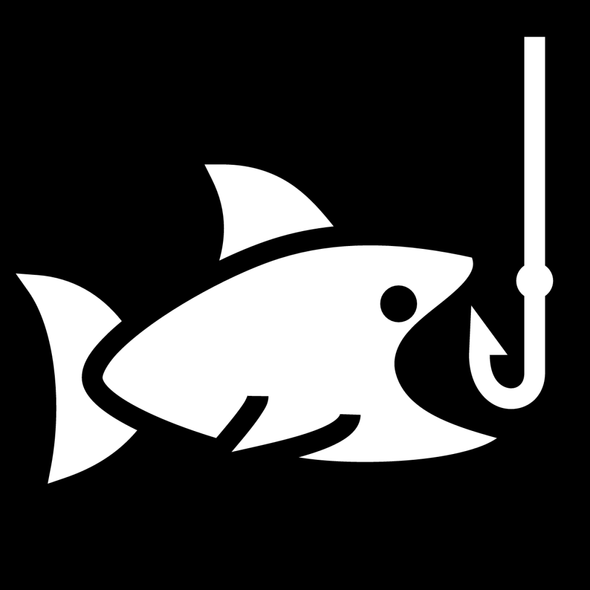

```{r, setup-lm1, include=FALSE}
library(ggformula)
library(tidyverse)
library(dagitty)
library(CalvinBayes)
library(patchwork)

knitr::opts_chunk$set(echo = TRUE, 
                      fig.width = 7, 
                      fig.height = 3,
                      tidy = FALSE,
                      fig.align = 'center', 
                      message = FALSE, 
                      warning = FALSE,
                      error = TRUE,
                      out.width = '60%', 
                      dpi = 300)
theme_set(theme_minimal(base_size = 22))
```

class: huge, center, inverse
# Old System:

# "Include every predictor you think is relevant and important"

---
# (Data) Size Matters!

- $p < \frac{n}{15}$: *Roughly* 10-20 "events" per parameter estimated ([Harrell 2015](https://link.springer.com/book/10.1007/978-3-319-19425-7))
- Assumes even dist. over categories
- Consider: domain expertise, data availability, missing-ness, dynamic range...*& expected causal relationships*

---
# Causal Diagrams
### There's more to planning than just p < n/15!

```{r, simple-causal-diagram, echo = FALSE, out.width='85%'}
# create the DAG object
causal_diagram_1 <- dagitty("dag{
  X -> Y;
}")
# plot it
gg_dag(causal_diagram_1, size = 16)
```

---
## "Causal"? 
### Can we actually make *causal conclusions*?

.small[
- If detect association, can conclude \_\_\_ *causes* \_\_\_ IFF...
<br>
<br>
- Otherwise:
<br>
<br>
- So why use "causal" diagrams to plan models?
  - Transparency about assumptions
  - Clear, consistent way to choose predictors
  ]

---

## H.E.A.L.T.H. Camp Example

```{r}
#| echo: false
#| out-width: "85%"
knitr::include_graphics("https://calvin.edu/sites/default/files/styles/wide/public/2025-01/Untitled%20Website%20Image.png?itok=jVQourMM")
```

.smaller[
[Health Education And Leadership Training for a Hopeful future (H.E.A.L.T.H) Camp](https://calvin.edu/camps/health-camp) "is a free weeklong summer camp for young people from mostly medically underserved communities in Grand Rapids to learn more about their own health and health careers at Calvin U."
]

---
## H.E.A.L.T.H. Camp Example
### Response: Test Score

.pull-left[
- Age
- Sex 
- Grade in school
- Neighborhood
- Race & Ethnicity
]

.pull-right[
- Income
- Interest in health career
- Timepoint (before/after camp)
]
---
# Classify to Plan

- *First* choose a key predictor whose effect you'll quantify
- Determine other candidate predictors' relative roles
- Include/exclude in model depending on this classification
---
# Confounder
### a.k.a. "common cause"

```{r}
#| echo: false
#| out-width: "55%"
knitr::include_graphics("https://statistics4ecologists-v3.netlify.app/Graphics/icec.png")
```

.smaller[image: [Fieberg, *Statistics for Ecologists* Figure 7.3](https://statistics4ecologists-v3.netlify.app/07-causalnetworks), used under [CC BY 4.0 license](https://creativecommons.org/licenses/by/4.0/)]

---
# Confounder

```{r, echo = FALSE, out.width="90%"}
knitr::include_graphics("https://cdn.prod.website-files.com/65742dd6baffc440d2cb545d/659828104420b31ac861bf80_simpsons.png")
```

**But...What's** *wrong* **with this picture?**

.smaller[Image: [https://www.causa.tech](https://www.causa.tech/post/causal-inference-beyond-the-limits-of-conventional-machine-learning)]

---
# Precision Covariate

---
# Mediator

---
# Collider

```{r, echo=FALSE, out.width="25%", fig.cap="U. MN St Paul Campus"}
knitr::include_graphics("https://upload.wikimedia.org/wikipedia/commons/thumb/6/6a/University_of_Minnesota_Logo.svg/1024px-University_of_Minnesota_Logo.svg.png?20200121234844")
```

.pull-left[
```{r, echo=FALSE, out.width="45%", fig.align='center', fig.show='hold', fig.cap="Food Science Interest"}

```
]

.pull-right[
```{r, echo=FALSE, out.width="45%", fig.align='center', fig.cap="Days Fishing"}

```
]

.smaller[images: <https://commons.wikimedia.org>, <https://iconduck.com/icons/23458/fishing>, <https://www.flaticon.com/free-icon/nutrition_649371>]

---
# Collider
### Fishing *or* Food -> St Paul

```{r, echo = FALSE, fig.width=8, fig.height=3, out.width = "90%"}
set.seed(1040)
# number of students
n <- 10000
# Generate X = interest in nutrition and food science
stpaul <- tibble(x = runif(n, 0, 10),
                     # Generate hours fishing
                     y = rpois(n, lambda = 4),
                     # prob of St Paul
                     p = exp(-5 + 1.5*x + 1.5*y)/(1+exp(-5 + 1.5*x + 1.5*y)),
                     z = rbinom(n, 1, prob = p))
overall <- gf_point(y ~ x, data =stpaul, alpha = 0.2) |> 
  gf_labs(x = "Food Science Interest Level",
          y = "Days Fishing\n(per year)",
          title = "Overall") |>
  gf_lm(color = "darkred", size = 2)
in_stpaul <- gf_point(y ~ x, data =stpaul |> filter(z == 1) , alpha = 0.2) |> 
  gf_labs(x = "Food Science Interest Level",
          y = "Days Fishing\n(per year)",
          title = "St Paul Campus") |>
  gf_lm(color = "darkred", size = 2)

overall + in_stpaul + plot_layout(ncol = 2, axis_titles = "collect")
```

.smaller[Example from [J. Fieberg](https://statistics4ecologists-v3.netlify.app/07-causalnetworks#collider-bias)]

---
# Collider

---
# Moderator or Modifier
## Also known as: *Interaction*

---
# Can get complex
## M-Bias

```{r, m-bias-diagram, echo = FALSE, out.width='85%'}
# create the DAG object
causal_diagram_2 <- dagitty("dag{
  X -> Y;
  A -> X;
  A -> D;
  B -> Y;
  B -> D;
}")
# plot it
gg_dag(causal_diagram_2, size = 16, highlight = c('X', 'Y'))
```

.small[
*We've chosen some simple principles but there could be much more to learn!*
]
.smaller[
*Resource: Guide to Causal Inference <https://doi.org/10.1098/rspb.2020.2815>*
]
---
# Look back
## which variables should be predictors
## to model HEALTH Camp test score?
<br>
## score ~ 
<br>
.smaller[Maybe see: [Model Planning Checklist](https://stacyderuiter.github.io/stat245-fa24/model-plan-checklist.pdf)]

---
# Going Further
### References & Resources

.small[
- [A biologist's guide to model selection and causal inference](https://doi.org/10.1098/rspb.2020.2815) (Laubach et al.)
- *Statistics for Ecologists* (J. Fieberg) [Ch. 7](https://statistics4ecologists-v3.netlify.app/07-causalnetworks)
- *Statistical Modeling* (D. Kaplan) [Ch. 17](https://dtkaplan.github.io/SM2-bookdown/causation.html)
- [An Introduction to Causal Inference](https://osf.io/preprints/psyarxiv/b3fkw_v1) (F. Dablander)
- and maybe, *The Book of Why* (J. Pearl & D. Mackenzie, ISBN: 978-0465097609)
]

---

## What's Your Model Process?

---
# Feedback
## <https://cutt.ly/arm-feedback>

```{r, echo = FALSE, out.width = "40%", fig.align='center'}
knitr::include_graphics("images/quick-feedback-qr-code.png")
```
