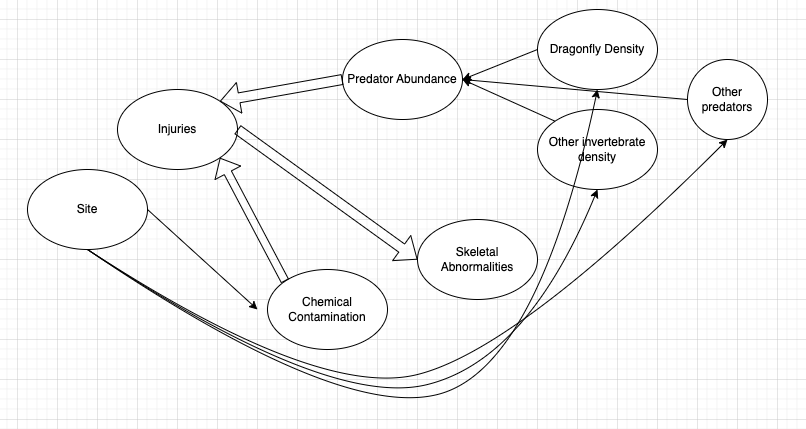

```{r, frog-binary-setup, include=FALSE}
library(tidyverse)
library(mosaic)    
library(ggformula)
library(glmmTMB)
knitr::opts_chunk$set(echo = TRUE, 
                      fig.width = 7, 
                      fig.height = 3,
                      tidy = FALSE,
                      fig.align = 'center', 
                      message = FALSE, 
                      warning = FALSE,
                      error = TRUE,
                      out.width = '60%', 
                      dpi = 300)
theme_set(theme_minimal(base_size = 22))
```

# Data Source
#### Original source: <http://datadryad.org/resource/doi:10.5061/dryad.sq72d>
#### Our version at: <https://sldr.netlify.app/data/FrogAbnormalities.csv>

```{r, frogdat, echo = FALSE}
frogs <- read_csv(
  'https://sldr.netlify.app/data/frog-abnormalities.csv',
  show_col_types = FALSE)
```

<iframe width="560" height="315" src="https://www.youtube.com/embed/U9Vj_GQFGHQ" frameborder="0" allow="accelerometer; autoplay; clipboard-write; encrypted-media; gyroscope; picture-in-picture" allowfullscreen></iframe>

---
.small[
Variables in the dataset include:

-   IDs: `collection_id`, `frog_id`, `site`
-   Info on time of data collection: `date`, `year`,
    `coll_date`
-   Size and developmental stage of the frog:
    `gosner_stage`, `tail_length` (which is longer for young frogs, that
    is, tadpoles)
-   Whether or not the frog has any abnormality in general (`abnormal`),
    an injury (`bleeding_injury`), or a specific type of abnormality:
    `skeletal_abnormality`, `eye_abnormality`, `surface_abnormality`
-   Relative abundance of invertebrate predators of frogs:
    `dragonfly_relative_density` and `other_invert_relative_density`
-   *Rough* water testing results:
    `detectable_analytes` (average number of contaminants present)
]

---
# Binary Response

- `abnormal` has values "no" and "yes"
- which do we want to call *success* & predict probability of?

```{r, echo = FALSE, fig.width = 10, fig.height = 4}
gf_bar(~skeletal_abnormality, data = frogs)
```

---
# Dataset Size: n/15 revised

- To estimate P(success), is ~15 rows of data enough? It depends...

--

.small[
- We will definitely need a bigger dataset to estimate the probability of "success" *when success is very rare*
- Let $s$ be the total number of successes in the dataset, and $f$ the number of failures.
- Limiting sample size $m$ is $min(s, f)$
- Number of coefficients we can estimate is about $\frac{m}{15}$
]


---
### Model Plan?

.smaller[

> > The repeated occurrence of abnormal amphibians in nature points to
> > ecological imbalance, yet identifying causes of these abnormalities
> > has proved complex. Multiple studies have linked amphibian
> > abnormalities to chemically contaminated areas, but inference about
> > causal mechanisms is lacking. Here we use a high incidence of
> > abnormalities in Alaskan wood frogs to strengthen inference about
> > the mechanism for these abnormalities. We suggest that limb
> > abnormalities are caused by a combination of multiple stressors.
> > Specifically, toxicants lead to increased predation, resulting in
> > more injuries to developing limbs and subsequent developmental
> > malformations. We evaluated a variety of putative causes of frog
> > abnormalities at 21 wetlands on the Kenai National Wildlife Refuge,
> > south-central Alaska, USA, between 2004 and 2006. Variables
> > investigated were organic and inorganic contaminants, parasite
> > infection, abundance of predatory invertebrates, UVB, and
> > temperature. Logistic regression and model comparison using the
> > Akaike information criterion (AIC) identified dragonflies and both
> > organic and inorganic contaminants as predictors of the frequency of
> > skeletal abnormalities. We suggest that both predators and
> > contaminants alter ecosystem dynamics to increase the frequency of
> > amphibian abnormalities in contaminated habitat. Future experiments
> > should test the causal mechanisms by which toxicants and predators
> > may interact to cause amphibian limb abnormalities. - Reeves et al.
> > 2010, <https://doi.org/10.1890/09-0879.1>

]
---
## Causal Diagram?

```{r, causal, echo = FALSE, out.width='97%'}

```

---
# Critique?

```{r, eval = FALSE}
skeletal_abnormality ~ detectable_analytes +
  dragonfly_relative_density +
  other_invert_relative_density
```

--

.small[

-   Why not include injuries? 
-   Would you include site? 
-   Why isn't the frog's developmental stage in there?
  
]
---

# Regression Evolution
## old: linear regression 

.small[
$$y_i = \beta_0 + \beta_1 x_{1,i} + \beta_2 x_{2,i} + \beta_3 x_{3,i} + \dots \beta_k x_{k,i} + \epsilon_i$$
]

- where $x$s are the $k$ predictor variables, 
- $\beta$s are the parameters to be estimated by the model, 
- and $\epsilon \sim N(0,\sigma)$ are the model residuals.

---

## Regression Evolution

.small[
When our response variable was a *count* variable, we modified our equation to:
]

--

$$log(\lambda_i) = \beta_0 + \beta_1 x_{1,i} + \beta_2 x_{2,i} + \dots \beta_k x_{k,i}$$

--

.small[
positing that $y_i \sim Pois(\lambda_i)$ and $\epsilon_i = y_i - \lambda_i$ for Poisson regression; similarly for negative binomial regression, we just replaced that Poisson distribution with a negative binomial distribution (and replaced $\lambda_i$ with $\mu_i$, stating that $y_i \sim NegBin(\mu_i, \phi)$ and $\epsilon_i = y_i - \mu_i$).
]
---

# Binary Response?

What if our response variable is *binary* -- a categorical variable with just two possible values?  We will designate one of the two values a "success," and then we want to predict the probability of success as a function of some set of predictors.  What will our model equation look like in this case?

---

# Which Distribution?
### The [Binomial](https://en.wikipedia.org/wiki/Binomial_distribution)!

$$
P(x = s \vert n, p) = {n \choose s}p^s(1-p)^{(n-s)}
$$
--

$$
X \sim Binom(n, p)
$$

---

# Link Functions?
### logit is a common default (depends on discipline)

```{r, echo = FALSE, fig.width = 10, fig.height=4, out.width="90%"}
link_examples <- tibble(
  p = seq(from = 1e-5, to = 1-1e-5, length.out = 250),
  logit = log(p/(1 - p)),
  probit = qnorm(p),
  cloglog = log(-log1p(-p)))

gf_line(logit ~ p, 
        data = link_examples,
        color = "black", linewidth = 2, alpha = 0.7) |>
  gf_line(probit ~ p, linetype = "dashed", linewidth = 2, alpha = 0.7) |>
  gf_line(cloglog ~ p, linetype = "dotted", linewidth = 2, alpha = 0.7) |>
  gf_labs(y = "Transformed Value",
          title = "Link Functions",
          subtitle = "Solid: logit, dashed: probit, dotted: cloglog")
```


---
## Binary Regression Equation

$$logit(p_i) = log(\frac{p_i}{(1-p_i)}) =$$

--

$$\beta_0 + \beta_1 x_{1,i} + \beta_2 x_{2,i} + ...\beta_k x_{k,i}$$

.small[
Where: $\text{response} \sim Binom(n, p_i)$ and there *are* still residuals: observed successes (from data) minus expected successes (according to the model, according to $p_i$)
]

<!-- --- -->
<!-- # GLM Structure -->

<!-- So we can think about the model equation for a GLM like: -->

<!-- $$ -->
<!-- \text{link function}(\text{parameter of probability distribution}_i) = ... -->
<!-- $$ -->
<!-- $$ -->
<!-- \beta_0 + beta_1 x_{1i} + \beta_2 x_{2i} + ...\beta_{ki} -->
<!-- $$ -->
<!-- $$\text{response}_i \sim \text{probability distribution}(\text{parameter}_i, \text{...other parameters, maybe})$$ -->

<!-- $$ -->
<!-- \epsilon_i = \text{response}_i - \text{expected response}_i -->
<!-- $$ -->

---

class: small

# Back to Frogs...
## How does this equation relate back to our desired response variable? 

- $y_i$, the $i$th observation of the response variable is assumed to follow a binomial distribution with probability $p_i$ 
- In other words: $y_i \sim Binom(n_i, p_i)$ 
- $n_i$ depends on the setup of the data -- often n = 1 for each row of the dataset, as here where each row is one frog. We can think of each frog as one binomial trial, with success/failure meaning abnormality/normality of the frog.

---

## Checking the data setup

- We would like to model the proportion frogs with abnormalities as a function of a set of predictors. 
- The variable `skeletal_abnormality` has values "Yes" and "No".  
- In R, if we use this (categorical) variable as our response, how will R determine which level (value of the variable) is a "success"?

---
## Response Variable

```{r}
frogs |>
  # pull out just the variable in question
  pull(skeletal_abnormality) |>
  # print out the variable's unique values
  levels()
```

---
## Binary models *require* a `factor()` Response Variable
### (or one that is coded 0, 1)

.small[
```{r}
frogs <- frogs |>
  # force our response to be "factor" not "character". 
  # This will also auto-sort the levels in to ALPHA ORDER.
  # So DON'T do it AFTER you have carefully re-ordered  them!
  mutate(skeletal_abnormality = factor(skeletal_abnormality))
```

```{r}
# to check the results:
frogs |>
  # pull out just the variable in question
  pull(skeletal_abnormality) |>
  # print out the variable's unique values
  levels()
```
]

---
# Data Prep for Binary Model
## Choosing the Order of `factor` Variable Values

.small[
```{r}
# list the values in the "new" order you want
frogs <- frogs |> 
  mutate(skeletal_abnormality = 
           fct_relevel(skeletal_abnormality, 'No', 'Yes'))
```


```{r}
# if you want to check the result
frogs |> pull(skeletal_abnormality) |> levels()
```
]

---


# Model Fitting 
### *Before* this, make sure response is a factor

```{r, lrm-frogs, echo=TRUE, error = TRUE}
frog_model <- glmmTMB(skeletal_abnormality ~ 
                        detectable_analytes + 
                        dragonfly_relative_density +
                        other_invert_relative_density,
                 data = frogs,
                 family = binomial(link = 'logit'))
```


---
class: smaller

```{r}
summary(frog_model)
```

---
# Assessment
## Conditions to Check

--

- Response is really binary!
- **L**ogit-linearity of predictor, response relationship
- **I**ndependence of residuals
- Mean-variance relationship is as expected
  - "mean" is expected response value
  - "variance" is spread of residuals

---
# Assessment
## ACF to check independence

.small[]
```{r, frog-assess1, fig.height=2.8, echo=TRUE}
s245::gf_acf(~resid(frog_model))
# or: acf(resid(frog_model))
```
]

---
## Do not use this code!

.small[
```{r, frog-assess2, echo=TRUE, fig.height=4}
# DO NOT USE THIS IN YOUR OWN ASSESSMENT OF YOUR MODELS!
gf_point(resid(frog_model, type='pearson') ~ fitted(frog_model)) |>
  gf_labs(title='frog_model', 
          y=' Pearson\nResiduals',x='Fitted Values')
```
]

---
## Assessment
### Scaled Residual Plot to check mean-variance, linearity

.small[
```{r, frog-assess3, echo=TRUE, fig.height=4}
# ACUTALLY USE **THIS** WAY FOR MEAN-VARIANCE CONDITION
library(DHARMa)
sim_frog_res <- simulateResiduals(frog_model)
plotResiduals(sim_frog_res, quantreg = FALSE)
```
]

---
# Selection
## Just as usual. 
## For example, using ANOVA:

.small[
```{r}
car::Anova(frog_model)
```
]

---
##  Prediction Plots (same as ever)

```{r, fig.width=6.5, message = FALSE}
library(ggeffects)
predict_response(frog_model,
          terms = 'dragonfly_relative_density') |>
  plot()
```

---

## Prediction Plots

```{r, fig.width=6.5}
ggpredict(frog_model, 
          terms = 'detectable_analytes') |>
  plot()
```

---
# Feedback
## <https://cutt.ly/arm-feedback>

```{r, echo = FALSE, out.width = "40%", fig.align='center'}

```
